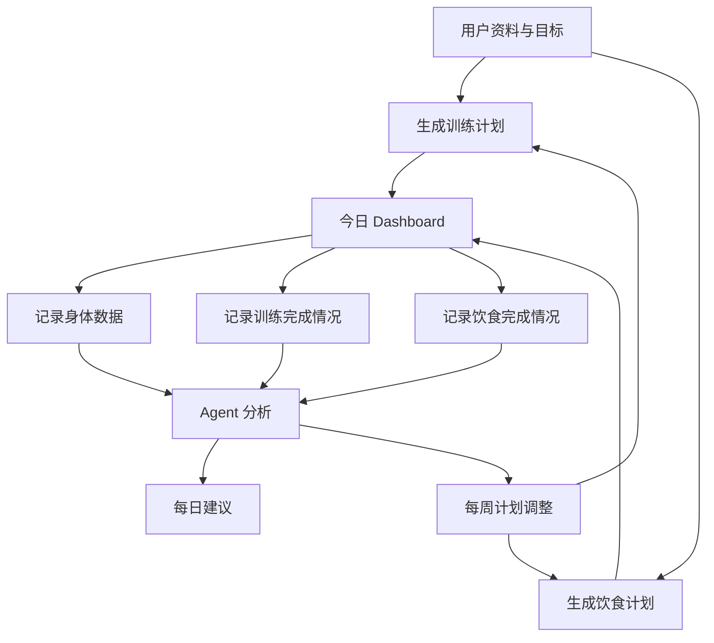

# 945 产品需求文档

版本：v0.1  
日期：2026-07-10  
阶段：MVP 需求定义  
产品类型：健身与饮食智能体工作台  

## 1. 产品概述

945 是一个面向普通用户、健身新手、增肌用户、减脂用户和长期健康管理用户的个人健身与饮食智能体。

它不是单纯的聊天机器人，也不是一次性训练计划生成器。945 的核心价值是把“计划生成、每日执行、数据记录、趋势分析、智能建议、计划调整”串成一个长期闭环。

用户每天打开 945 时，应该可以快速看到：

- 今天要练什么
- 今天要怎么吃
- 今天需要记录什么
- 最近身体和执行情况怎么样
- Agent 根据最近数据给出的建议

## 2. 背景和机会

现有健身 App 通常分成几类：

- 训练记录工具：能记录动作、组数、重量，但不懂用户目标。
- 饮食记录工具：能记录热量和营养，但训练联动弱。
- AI 聊天工具：能回答健身问题，但缺少结构化数据和长期记忆。
- 计划生成工具：能生成计划，但不能根据真实执行持续调整。

945 要解决的问题是：用户不是缺少一份计划，而是缺少一个能理解目标、记录执行、看懂变化、持续调整的个人健身 Agent。

## 3. 产品目标

### 3.1 MVP 目标

第一版需要完成一个可用闭环：

1. 用户填写基础资料和目标。
2. 系统生成训练计划和饮食计划。
3. 用户每天查看今日计划。
4. 用户记录身体数据、训练完成情况和饮食完成情况。
5. Agent 根据记录给出建议。
6. 用户可以基于建议调整后续计划。

### 3.2 非目标

第一版不追求：

- 完整商业化系统
- 完整账号体系
- 复杂社交功能
- 原生移动 App
- 食物图片识别
- 穿戴设备接入
- 医疗诊断或康复处方
- 复杂教练后台
- 极致视觉风格

## 4. 目标用户

945 第一版面向广义健身用户，不只服务单一目标。

### 4.1 用户类型

| 用户类型 | 目标 | 关键需求 |
| --- | --- | --- |
| 减脂用户 | 降低体重或体脂 | 饮食控制、热量目标、训练执行、体重趋势 |
| 增肌用户 | 增加肌肉和力量 | 训练容量、蛋白摄入、体重增长、恢复管理 |
| 塑形用户 | 改善体态和身材 | 训练计划、围度变化、饮食稳定性 |
| 新手用户 | 建立习惯 | 简单计划、动作解释、低压力打卡 |
| 进阶用户 | 优化表现 | 训练负荷、恢复、周期调整 |
| 健康维持用户 | 保持规律生活 | 稳定运动、饮食平衡、轻量建议 |

### 4.2 第一版默认用户

第一版先使用 **本地 demo 用户**。

要求：

- 不要求登录注册。
- 系统内置一个默认用户身份。
- 用户数据可以存储在本地数据库或后端 demo 数据中。
- 前端和后端结构需要为未来账号体系预留 `user_id`。

## 5. 产品命名

产品名称：945

说明：

- 所有新文档、界面标题和产品名称统一使用 945。
- 旧文档中出现的 FitAgent 只作为历史占位，不作为最终产品名。

## 6. 核心产品闭环



## 7. 系统架构要求

945 基于 `zen-apps/ai-fitness-planner` 改造。

### 7.1 保留的后端基础

- FastAPI：后端 API 服务。
- LangGraph：多 Agent 编排。
- MongoDB：MVP 数据存储。
- Profile Agent：用户画像。
- Meal Planner Agent：饮食计划生成。
- Workout Planner Agent：训练计划生成。
- USDA 食物数据和 FAISS 搜索：饮食计划辅助。

### 7.2 新增能力

- 本地 demo 用户模式。
- 今日 Dashboard API。
- 身体数据记录。
- 训练记录。
- 饮食记录。
- 每日打卡。
- Advice Agent。
- Plan Adjustment Agent。
- 多语言文本结构。
- 前端 React 工作台。

## 8. 平台和技术边界

### 8.1 前端

推荐：

- React 或 Next.js。
- Dashboard + Agent Chat 的产品结构。
- 第一版不强制锁定 Agent Chat 的最终位置。
- 需要为多语言界面预留 i18n 能力。

### 8.2 后端

推荐：

- FastAPI。
- Python Agent 逻辑。
- LangGraph 编排。
- MongoDB 存储。
- Pydantic 定义请求和响应模型。

### 8.3 多语言要求

第一版界面必须具备多语言架构。

要求：

- 前端所有用户可见文案不得硬编码在组件中。
- 至少预留 `zh-CN` 和 `en-US` 两套语言结构。
- MVP 可以优先完整实现中文。
- 英文可以先提供基础 key/value，占位内容也需要结构完整。
- 用户设置中预留语言切换入口。
- 数字、日期、单位展示需要考虑国际化。

第一版语言范围：

- 中文：主要界面语言。
- 英文：结构预留，基础文案可逐步补齐。

## 9. 信息架构

第一版主导航：

1. 今日
2. 训练
3. 饮食
4. 身体数据
5. 建议
6. Agent
7. 设置

说明：

- Agent Chat 的最终位置暂不固定。
- 实现时可以先做成独立页面、右侧面板或全局浮层。
- 最终位置在看到可运行效果后再决定。

## 10. 页面需求

### 10.1 首次引导页

目标：收集生成计划所需的最小资料。

字段：

- 昵称
- 年龄
- 性别，可选
- 身高
- 体重
- 当前目标
- 训练经验
- 每周可训练天数
- 每次训练时长
- 可用器械
- 饮食偏好
- 过敏或忌口
- 当前限制或注意事项

目标选项：

- 减脂
- 增肌
- 塑形
- 力量提升
- 心肺和体能
- 健康维持

完成后：

- 保存 demo 用户资料。
- 进入计划生成页。

### 10.2 计划生成页

目标：让用户基于资料生成初始训练和饮食计划。

功能：

- 展示用户目标摘要。
- 展示训练设置摘要。
- 展示饮食设置摘要。
- 提供“生成计划”按钮。
- 展示生成中状态。
- 生成完成后展示计划预览。
- 用户可以接受计划。
- 用户可以要求 Agent 解释计划。

计划内容：

- 一周训练安排。
- 每天动作、组数、次数、重量或强度建议。
- 一周饮食安排。
- 每天热量和宏量营养目标。
- 每餐建议。

### 10.3 今日页

目标：作为用户每天的主工作台。

模块：

- 今日状态摘要。
- 今日训练。
- 今日饮食。
- 身体数据快捷记录。
- 每日打卡。
- Agent 今日建议。
- 本周进度。

今日状态摘要：

- 当前目标。
- 本周训练完成数。
- 今日热量进度。
- 今日蛋白质进度。
- 最近体重变化。
- 恢复状态。

今日训练：

- 训练名称。
- 预计时长。
- 动作列表。
- 每个动作的组数、次数、重量或强度。
- 完成训练。
- 部分完成。
- 跳过训练。
- 记录备注。

今日饮食：

- 今日热量目标。
- 蛋白质、碳水、脂肪目标。
- 餐次列表。
- 每餐建议。
- 确认计划餐已完成。
- 手动输入实际饮食。

每日打卡：

- 体重。
- 睡眠。
- 疲劳。
- 酸痛。
- 压力或心情，可选。
- 备注。

Agent 今日建议：

- 一条主建议。
- 2 到 3 条行动建议。
- 触发原因。
- 可选操作按钮。

### 10.4 训练页

目标：查看训练计划、记录训练、查看训练历史。

功能：

- 查看本周训练计划。
- 查看每天训练安排。
- 查看动作详情。
- 记录训练完成情况。
- 记录单个动作表现。
- 查看训练历史。
- 查看训练完成率。
- 查看训练量趋势。

训练记录字段：

- 日期。
- 计划 ID。
- 训练名称。
- 动作名称。
- 组数。
- 次数。
- 重量。
- RPE 或主观难度。
- 是否完成。
- 备注。

第一版不要求：

- 动作视频。
- 复杂训练周期图。
- 自动重量进阶算法的精细 UI。

### 10.5 饮食页

目标：查看饮食计划、记录饮食、查看营养进度。

功能：

- 查看今日饮食计划。
- 查看一周饮食计划。
- 查看每餐建议。
- 查看热量和宏量营养目标。
- 确认计划餐完成。
- 手动输入实际饮食。
- 查看饮食历史。

第一版饮食记录方式：

1. 计划餐确认：用户直接确认某餐按计划完成。
2. 手动输入：用户输入食物、份量和估算营养。

第一版不做：

- 食物图片识别。
- 条形码扫描。
- 外卖平台接入。
- 自动识别餐盘。

### 10.6 身体数据页

目标：展示用户身体变化和趋势。

功能：

- 记录体重。
- 记录体脂率，可选。
- 记录围度，可选。
- 自动计算 BMI。
- 展示 7 天、30 天、90 天趋势。
- 根据目标展示不同重点指标。

目标差异：

- 减脂：体重趋势、腰围、热量执行率。
- 增肌：体重趋势、训练量、蛋白质摄入。
- 塑形：围度、体重、训练完成率。
- 力量：动作重量趋势、训练完成率。
- 体能：训练频率、心肺训练完成情况。
- 健康维持：运动频率、饮食稳定性、体重稳定性。

### 10.7 建议页

目标：集中展示 Agent 建议、周总结和计划调整原因。

功能：

- 今日建议。
- 本周总结。
- 历史建议列表。
- 计划调整记录。
- 是否采纳建议。
- 建议来源说明。

每条建议包含：

- 建议标题。
- 建议正文。
- 触发原因。
- 关联数据。
- 推荐行动。
- 风险级别。
- 用户反馈：采纳 / 不采纳 / 稍后。

### 10.8 Agent 页或 Agent 面板

目标：提供自然语言交互能力。

Agent Chat 的最终位置暂不决定。

第一版实现允许以下任一形态：

- 独立 Agent 页面。
- 桌面端右侧面板。
- 全局浮层。

核心能力：

- 解释训练计划。
- 解释饮食计划。
- 回答今天怎么练。
- 回答这顿饭如何处理。
- 根据用户输入生成记录草稿。
- 请求调整计划。
- 解释建议来源。

关键规则：

- Chat 不替代结构化表单。
- 任何关键数据写入前必须用户确认。
- Agent 不能直接静默修改训练计划或饮食计划。
- Agent 必须能说明建议基于哪些数据。

### 10.9 设置页

目标：管理用户偏好和系统设置。

功能：

- Demo 用户资料。
- 当前目标。
- 训练偏好。
- 饮食偏好。
- 单位设置。
- 语言设置。
- 安全声明。
- 数据导出入口，后续功能。

第一版不做完整账号体系，但保留未来登录入口位置。

## 11. 功能模块

### 11.1 用户资料模块

能力：

- 创建 demo 用户资料。
- 更新用户基础资料。
- 更新训练目标。
- 更新训练偏好。
- 更新饮食偏好。

数据字段：

- `user_id`
- `display_name`
- `age`
- `gender`
- `height`
- `weight`
- `goal`
- `experience_level`
- `training_days_per_week`
- `training_duration_minutes`
- `equipment`
- `dietary_preferences`
- `allergies`
- `constraints`
- `locale`
- `unit_system`

### 11.2 计划模块

能力：

- 生成训练计划。
- 生成饮食计划。
- 查看当前计划。
- 接受计划。
- 标记计划是否正在执行。
- 保存计划调整记录。

计划类型：

- `workout_plan`
- `meal_plan`
- `weekly_plan`

### 11.3 今日模块

能力：

- 获取今日训练。
- 获取今日饮食。
- 获取今日打卡状态。
- 获取今日建议。
- 获取本周摘要。

今日页是多个模块的聚合视图，不应直接承载复杂业务逻辑。

### 11.4 训练记录模块

能力：

- 创建训练记录。
- 更新训练记录。
- 标记训练完成、部分完成或跳过。
- 记录动作级数据。
- 查看训练历史。

状态：

- `planned`
- `completed`
- `partially_completed`
- `skipped`

### 11.5 饮食记录模块

能力：

- 确认计划餐完成。
- 手动创建饮食记录。
- 更新饮食记录。
- 查看每日营养进度。
- 查看饮食历史。

记录来源：

- `planned_meal_confirmation`
- `manual_entry`

### 11.6 身体数据模块

能力：

- 记录体重。
- 记录体脂率。
- 记录围度。
- 查看趋势。
- 计算 BMI。

### 11.7 每日打卡模块

能力：

- 创建每日打卡。
- 更新每日打卡。
- 查看连续记录情况。
- 为建议模块提供恢复和执行信号。

字段：

- `date`
- `weight`
- `sleep_hours`
- `sleep_quality`
- `fatigue_level`
- `soreness_level`
- `stress_level`
- `mood`
- `notes`

### 11.8 建议模块

能力：

- 生成每日建议。
- 生成每周总结。
- 生成计划调整建议。
- 展示建议来源。
- 记录用户是否采纳。

建议类型：

- `daily_advice`
- `weekly_summary`
- `plan_adjustment`
- `safety_warning`

### 11.9 多语言模块

能力：

- 根据用户语言设置展示界面文案。
- 支持语言切换。
- 支持中文和英文资源结构。
- 支持后续扩展更多语言。

要求：

- 所有导航、按钮、表单、错误、空状态、建议标签都走 i18n。
- Agent 输出语言应尽量跟随用户界面语言。
- 后端返回的枚举值不直接展示给用户，需要前端映射为本地化文案。

## 12. Agent 需求

### 12.1 Agent 角色

第一版至少包含：

- Profile Agent：理解用户目标和资料。
- Workout Planner Agent：生成训练计划。
- Meal Planner Agent：生成饮食计划。
- Advice Agent：根据记录给建议。
- Plan Adjustment Agent：调整后续计划。

### 12.2 Agent 能做

- 生成训练计划。
- 生成饮食计划。
- 解释计划。
- 分析执行情况。
- 生成每日建议。
- 生成每周总结。
- 建议调整计划。
- 把自然语言转为记录草稿。

### 12.3 Agent 不能做

- 医疗诊断。
- 治疗建议。
- 伤病康复处方。
- 极端节食建议。
- 承诺结果。
- 在用户出现高风险症状时继续推动训练。
- 未经用户确认直接写入关键数据。

### 12.4 高风险输入处理

当用户输入包含以下内容时：

- 胸闷
- 眩晕
- 晕厥
- 强烈疼痛
- 疑似受伤
- 心脏不适
- 极端节食
- 进食障碍倾向

Agent 应：

- 停止继续给高强度训练建议。
- 提醒用户暂停相关活动。
- 建议咨询医生或专业人士。
- 可以提供低强度恢复模式选项，但不得称为治疗方案。

## 13. 数据模型草案

### 13.1 `users`

- `user_id`
- `display_name`
- `created_at`
- `updated_at`
- `locale`
- `unit_system`

### 13.2 `user_profiles`

- `profile_id`
- `user_id`
- `age`
- `gender`
- `height`
- `weight`
- `goal`
- `experience_level`
- `training_preferences`
- `dietary_preferences`
- `allergies`
- `constraints`
- `updated_at`

### 13.3 `plans`

- `plan_id`
- `user_id`
- `plan_type`
- `goal`
- `start_date`
- `end_date`
- `status`
- `workout_plan`
- `meal_plan`
- `generated_by`
- `created_at`
- `updated_at`

### 13.4 `daily_checkins`

- `checkin_id`
- `user_id`
- `date`
- `weight`
- `sleep_hours`
- `sleep_quality`
- `fatigue_level`
- `soreness_level`
- `stress_level`
- `mood`
- `notes`
- `created_at`

### 13.5 `workout_logs`

- `workout_log_id`
- `user_id`
- `plan_id`
- `date`
- `status`
- `duration_minutes`
- `exercises`
- `rpe`
- `notes`
- `created_at`

### 13.6 `meal_logs`

- `meal_log_id`
- `user_id`
- `plan_id`
- `date`
- `meal_name`
- `source`
- `foods`
- `calories`
- `protein_g`
- `carbs_g`
- `fat_g`
- `notes`
- `created_at`

### 13.7 `body_metrics`

- `metric_id`
- `user_id`
- `date`
- `weight`
- `body_fat_percentage`
- `waist`
- `chest`
- `hip`
- `arm`
- `bmi`
- `notes`

### 13.8 `agent_advice`

- `advice_id`
- `user_id`
- `date`
- `type`
- `title`
- `content`
- `reason`
- `related_data`
- `recommended_actions`
- `risk_level`
- `accepted_status`
- `created_at`

## 14. API 需求草案

### 14.1 用户和资料

- `GET /api/demo-user`
- `POST /api/profile`
- `GET /api/profile/{user_id}`
- `PATCH /api/profile/{user_id}`

### 14.2 计划

- `POST /api/plans/generate`
- `GET /api/plans/current`
- `GET /api/plans/{plan_id}`
- `POST /api/plans/{plan_id}/accept`
- `POST /api/plans/{plan_id}/adjust`

### 14.3 今日

- `GET /api/today`

返回：

- 用户目标。
- 今日训练。
- 今日饮食。
- 今日打卡。
- 今日营养进度。
- 今日建议。
- 本周摘要。

### 14.4 训练记录

- `POST /api/workout-logs`
- `GET /api/workout-logs`
- `GET /api/workout-logs/{log_id}`
- `PATCH /api/workout-logs/{log_id}`

### 14.5 饮食记录

- `POST /api/meal-logs`
- `POST /api/meal-logs/confirm-planned-meal`
- `GET /api/meal-logs`
- `PATCH /api/meal-logs/{log_id}`

### 14.6 身体数据和打卡

- `POST /api/body-metrics`
- `GET /api/body-metrics`
- `POST /api/daily-checkins`
- `GET /api/daily-checkins`

### 14.7 建议和 Agent

- `POST /api/advice/daily`
- `POST /api/advice/weekly-summary`
- `GET /api/advice`
- `POST /api/agent/chat`
- `POST /api/agent/parse-record-draft`

## 15. 关键交互规则

### 15.1 写入确认

通过 Agent Chat 产生的关键写入必须二次确认。

关键写入包括：

- 保存训练记录。
- 保存饮食记录。
- 修改训练计划。
- 修改饮食计划。
- 修改目标。
- 采纳计划调整。

### 15.2 计划调整

计划调整不能静默发生。

流程：

1. Agent 提出调整建议。
2. 页面展示调整原因和影响。
3. 用户点击确认。
4. 系统生成或更新计划。
5. 页面展示新计划摘要。

### 15.3 空状态

空状态必须引导用户下一步。

示例：

- 没有计划：提示生成初始计划。
- 没有训练记录：提示开始今天训练。
- 没有饮食记录：提示确认计划餐或手动记录。
- 数据不足：提示连续记录 3 天后可获得更稳定建议。

### 15.4 错误状态

错误提示必须明确：

- 发生了什么。
- 用户可以怎么做。
- 是否可以重试。

## 16. 前端设计边界

用户后续会使用 Stitch 做原型图设计，所以第一版 PRD 不锁定具体视觉风格。

本阶段只要求：

- 功能模块完整。
- 页面结构清晰。
- 交互流程明确。
- 多语言能力预留。
- Agent Chat 位置可变。
- 数据展示不依赖具体视觉风格。

不在本 PRD 中强制定义：

- 最终颜色。
- 字体。
- 图标风格。
- 动效。
- 组件圆角。
- 品牌视觉系统。

## 17. 验收标准

### 17.1 功能验收

MVP 应满足：

- 可以使用本地 demo 用户进入系统。
- 可以完成基础资料填写。
- 可以生成训练计划。
- 可以生成饮食计划。
- 可以查看今日 Dashboard。
- 可以记录体重和每日状态。
- 可以记录训练完成情况。
- 可以确认计划餐或手动记录饮食。
- 可以看到基础身体趋势。
- 可以看到 Agent 今日建议。
- 可以请求每周总结或计划调整。
- 可以通过 Agent Chat 生成记录草稿。
- 关键写入前有确认。
- 界面文案走多语言结构。

### 17.2 边界验收

MVP 不应出现：

- 要求用户注册登录才能使用。
- 食物图片识别入口。
- 穿戴设备连接入口。
- 支付订阅入口。
- 社区或排行榜入口。
- 医疗诊断表述。
- Agent 未确认就修改计划或保存记录。

### 17.3 前端验收

前端应满足：

- 桌面端核心流程可用。
- 页面没有明显文本溢出。
- 页面没有明显元素重叠。
- 所有按钮有明确反馈。
- 加载、错误、空状态都有处理。
- Agent Chat 可以后续移动到不同布局位置。

## 18. 第一版实施优先级

### P0

- 本地 demo 用户。
- 用户资料表单。
- 计划生成。
- 今日 Dashboard。
- 今日训练展示。
- 今日饮食展示。
- 训练记录。
- 饮食计划餐确认。
- 饮食手动输入。
- 身体数据记录。
- 每日打卡。
- 基础 Agent Chat。
- 多语言结构。

### P1

- Agent 今日建议。
- 每周总结。
- 计划调整确认。
- 基础趋势图。
- 建议历史。
- 记录草稿确认。

### P2

- 更完整的英文文案。
- 动作替换。
- 食物替换。
- 数据导出。
- 更细的训练趋势。
- 更细的营养趋势。

## 19. 后续待决策

这些问题留到看到原型或可运行版本后再决定：

1. Agent Chat 最终放在右侧常驻、独立页面，还是浮层。
2. Stitch 原型确定后的视觉系统。
3. 是否要保留 Streamlit demo 页面。
4. 是否从 React 还是 Next.js 开始。
5. 是否需要在 MVP 后接入真实账号系统。
6. 是否需要中英文完整同步上线。
7. 饮食和训练计划的调整频率是否固定为每周。

## 20. 项目文件夹

当前项目文件夹：

```text
945/
```

当前 PRD 文件：

```text
945/PRD.md
```
