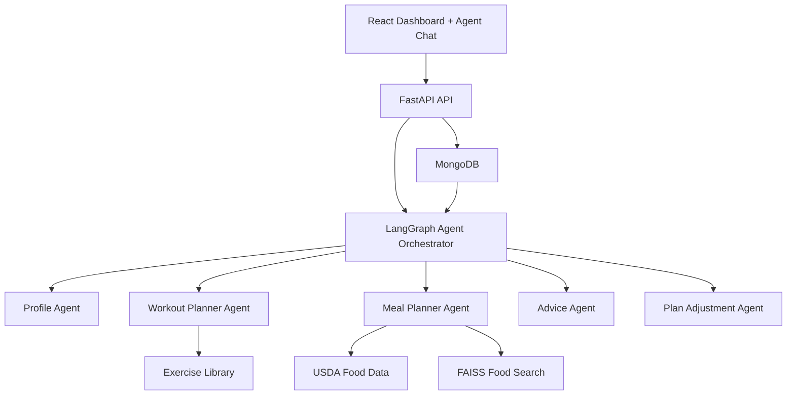
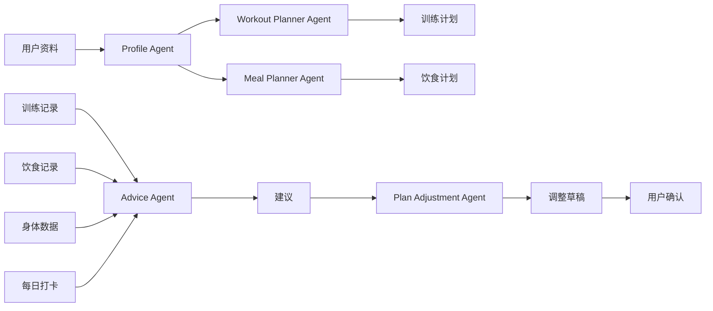
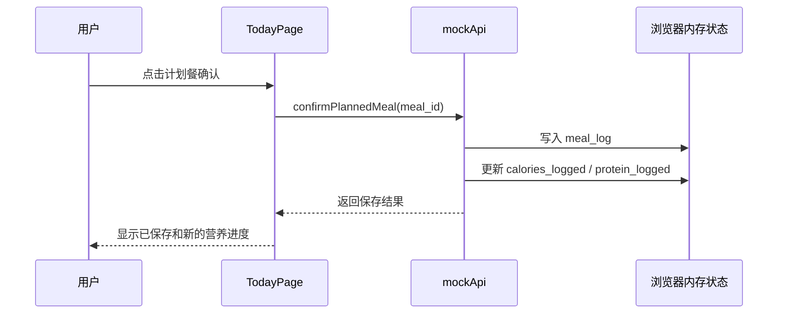
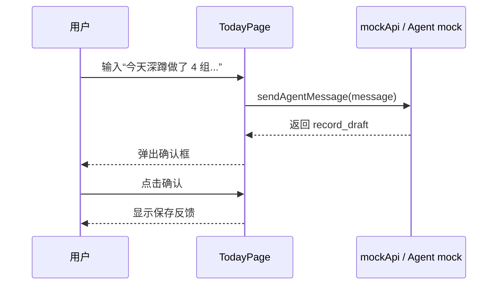

# 945 架构说明

本文档用于帮助你理解 945 这个健身饮食智能体项目的整体架构、当前代码处于什么阶段，以及后续真实 Agent 系统应该如何接入。

945 不是一个单纯的 Chatbot，也不是一次性生成训练计划的小工具。它的目标是做成一个长期使用的个人健身与饮食工作台，把计划生成、每日执行、数据记录、趋势分析、Agent 建议和计划调整串成闭环。

## 1. 一句话理解 945

945 的产品形态是：

```text
Dashboard + Agent Chat
```

Dashboard 负责结构化信息和高频操作，例如今日训练、今日饮食、身体数据、每日打卡、建议和设置。

Agent Chat 负责自然语言交互，例如解释训练计划、解释饮食计划、根据用户输入生成记录草稿、给出建议、发起计划调整。

关键原则：

- 用户不应该被迫通过聊天完成所有操作。
- 计划、记录、趋势和建议必须有结构化页面。
- Agent 可以提出建议和生成草稿。
- Agent 不能静默保存关键数据。
- 训练记录、饮食记录、计划调整等关键写入必须经过用户确认。

## 2. 总体目标架构

最终目标架构如下：



各层职责：

| 层级 | 职责 |
| --- | --- |
| React Dashboard + Agent Chat | 给用户展示计划、记录数据、确认 Agent 草稿和调整建议 |
| FastAPI API | 提供前后端接口，校验请求，组织业务服务 |
| LangGraph Agent Orchestrator | 编排多个 Agent 的执行顺序和状态流转 |
| Profile Agent | 理解用户目标、身体资料、训练经验、饮食偏好和限制 |
| Workout Planner Agent | 生成训练计划和训练调整建议 |
| Meal Planner Agent | 生成饮食计划和营养建议 |
| Advice Agent | 根据执行记录、身体数据和打卡生成建议 |
| Plan Adjustment Agent | 根据用户确认的建议调整后续计划 |
| MongoDB | 保存用户、资料、计划、训练记录、饮食记录、身体数据、建议和 Agent 消息 |
| USDA / FAISS / Exercise Library | 辅助饮食计划、食物搜索和训练动作生成 |

## 3. 当前项目处于什么阶段

当前仓库已完成本地 demo 用户下的 MVP 前后端闭环。默认开发模式仍使用 mock API；需要联调时，前端可以切换到 FastAPI HTTP adapter：

```text
React / Vite 前端
  -> TypeScript domain types
  -> mockApi 或 httpApi
  -> FastAPI（HTTP 模式）
  -> demo store + deterministic Agent Provider
```

默认 mock 开发模式：

```text
页面 -> mockApi -> demoData / 浏览器内存状态
```

真实 HTTP 联调模式：

```text
页面 -> httpApi -> FastAPI -> demo store / deterministic Agent Provider
```

MongoDB、真实模型和云部署仍需按环境接入。本项目已具备 Mongo repository、多用户鉴权、会话撤销和 Docker Compose 配置；本地 mock 联调仍不依赖这些外部服务。

### 本地生产化容器运行

仓库根目录提供 `docker-compose.yml`、`Dockerfile.backend`、`Dockerfile.frontend` 和 `.env.production.example`。复制示例环境文件为 `.env.production`，填入高强度 `945_AUTH_SECRET` 后执行：

```powershell
docker compose up --build -d
```

前端默认暴露在 `http://127.0.0.1:8080`，同源 `/api` 请求经 Nginx 转发给 FastAPI，MongoDB 数据保存在 Docker 命名卷中。

## 4. 当前前端代码结构

核心文件：

```text
src/
  App.tsx
  components/business/
    AppShell.tsx
    ConfirmDialog.tsx
    MetricCard.tsx
    ProgressBar.tsx
  pages/
    TodayPage.tsx
    PlanPage.tsx
    WorkoutPage.tsx
    DietPage.tsx
    BodyPage.tsx
    AdvicePage.tsx
    AgentPage.tsx
    SettingsPage.tsx
    PrototypeRouter.tsx
  types/
    domain.ts
  data/
    demoData.ts
  services/
    apiTypes.ts
    apiClient.ts
    httpApi.ts
    mockApi.ts
    recordDraft.ts
  i18n/
    zh-CN.ts
    en-US.ts
    index.ts
```

每部分职责：

| 文件 / 模块 | 作用 |
| --- | --- |
| `src/App.tsx` | 应用入口，决定显示业务页面还是 Stitch 原型 |
| `AppShell.tsx` | 业务工作台外壳，包括导航和语言切换 |
| `TodayPage.tsx` | 今日工作台，展示今日训练、饮食、打卡、建议和 Agent 输入 |
| `PlanPage.tsx` | 计划生成和计划预览 |
| `WorkoutPage.tsx` | 训练计划中心、今日训练执行、历史和训练量摘要 |
| `DietPage.tsx` | 饮食计划、计划餐确认和手动餐食 |
| `BodyPage.tsx` | 身体数据记录和趋势 |
| `AdvicePage.tsx` | Agent 建议、周总结和调整建议 |
| `AgentPage.tsx` | 智能教练对话和记录草稿确认 |
| `SettingsPage.tsx` | demo 用户资料、偏好、语言和后续能力边界 |
| `PrototypeRouter.tsx` | 保留 Stitch 导出页面，作为视觉参考 |
| `domain.ts` | 定义 User、Plan、WorkoutLog、MealLog、AgentAdvice 等核心类型 |
| `demoData.ts` | 本地 demo 用户、计划、餐食、训练和建议数据 |
| `mockApi.ts` | 默认开发模式的本地 API 实现 |
| `httpApi.ts` | HTTP 模式下调用 FastAPI，并归一化网络、校验和协议错误 |
| `recordDraft.ts` | 将已确认的训练或饮食草稿转换为结构化写入请求 |
| `i18n/*` | 多语言文案结构，当前支持 `zh-CN` 和 `en-US` |

## 5. 为什么要有 mockApi

`mockApi` 是当前阶段最重要的过渡层。

它让前端页面不用直接读取 `demoData`，而是像调用真实后端一样调用函数：

```ts
api.getToday()
api.confirmPlannedMeal()
api.saveDailyCheckin()
api.sendAgentMessage()
```

这样做的好处是：

- 前端先能跑起来。
- 交互可以真实改变页面状态。
- 后端还没完成时也能验证产品流程。
- 未来接 FastAPI 时，可以保持类似接口形状。

默认 mock 模式：

```text
TodayPage -> mockApi.confirmPlannedMeal -> 更新浏览器内存状态
```

HTTP 联调模式：

```text
TodayPage -> POST /api/meal-logs/confirm-planned-meal -> FastAPI -> demo store
```

## 6. 数据模型怎么理解

945 的核心数据集合包括：

```text
users
user_profiles
plans
daily_checkins
body_metrics
workout_logs
meal_logs
agent_advice
agent_messages
```

这些集合分别解决不同问题：

| 数据集合 | 保存什么 |
| --- | --- |
| `users` | 用户基础信息、语言、单位 |
| `user_profiles` | 年龄、身高、体重、目标、经验、偏好和限制 |
| `plans` | 训练计划和饮食计划 |
| `daily_checkins` | 睡眠、疲劳、酸痛、压力、备注 |
| `body_metrics` | 体重、体脂、腰围、BMI 等 |
| `workout_logs` | 实际训练记录 |
| `meal_logs` | 实际饮食记录 |
| `agent_advice` | Agent 给出的建议、原因、关联数据和风险级别 |
| `agent_messages` | 用户和 Agent 的聊天消息，以及记录草稿 |

这套数据模型的核心思想是：Agent 不是只看一条聊天消息，而是结合用户资料、计划、执行记录、身体变化和打卡状态来给建议。

## 7. Agent 系统怎么工作

未来真实 Agent 系统不是一个大模型提示词解决所有问题，而是多个 Agent 分工合作：



各 Agent 边界：

| Agent | 能做什么 | 不应该做什么 |
| --- | --- | --- |
| Profile Agent | 理解用户目标和限制 | 不生成具体训练处方 |
| Workout Planner Agent | 生成训练计划 | 不处理饮食计划 |
| Meal Planner Agent | 生成饮食计划 | 不处理训练动作安排 |
| Advice Agent | 根据记录和趋势给建议 | 不直接修改计划 |
| Plan Adjustment Agent | 生成计划调整草稿 | 不绕过用户确认直接写入 |

## 8. 两个关键数据流例子

### 8.1 用户确认计划餐

当前前端 mock 流程：



未来真实后端流程：

```text
TodayPage
  -> POST /api/meal-logs/confirm-planned-meal
  -> FastAPI
  -> MongoDB meal_logs
  -> 返回更新后的 today summary
```

### 8.2 Agent 生成训练记录草稿

当前前端 mock 流程：



真实系统里，`sendAgentMessage` 会进入 LangGraph，由 Agent 判断这句话是不是训练记录、饮食记录、计划调整请求或普通问题。

关键点：即使 Agent 识别出了记录，也只能生成草稿，不能直接写入。

## 9. 安全边界

第一版明确不做：

- 医疗诊断
- 治疗建议
- 康复处方
- 极端节食建议
- 承诺减脂或增肌结果
- 食物图片识别
- 穿戴设备接入
- 支付
- 社区
- 排行榜
- 完整账号体系

Agent 必须遵守：

- 用户报告胸闷、眩晕、强烈疼痛、疑似受伤时，优先提示停止训练并咨询专业人士。
- 高风险内容不能继续给高强度训练建议。
- 关键数据写入必须二次确认。
- 建议要能解释依据，例如最近训练完成率、疲劳评分、睡眠、饮食记录、体重趋势。

## 10. 前端路由和产品页面

PRD 里的主导航是：

```text
今日
训练
饮食
身体数据
建议
Agent
设置
```

当前已经有 `/app` 业务今日页面。Stitch 原型仍保留为视觉参考。

后续目标是逐步把这些页面都变成真实业务页面：

```text
/app 或 /              今日工作台
/workout              训练
/diet                 饮食
/body                 身体数据
/advice               建议
/agent                Agent
/settings             设置
/prototype            Stitch 参考页面
```

注意：Stitch 页面不是长期产品实现。它是视觉参考。长期产品实现应该是 React 组件 + 业务数据 + API 状态。

## 11. 当前如何运行

安装依赖：

```bash
npm install
```

启动开发服务器：

```bash
npm run dev
```

访问：

```text
http://localhost:5173/app
```

构建：

```bash
npm run build
```

运行当前业务页面 smoke QA：

```bash
npm run qa:app
```

`qa:app` 会用 Playwright + 本机 Chrome 检查：

- 计划餐确认
- 每日打卡保存
- Agent draft 确认
- 语言切换

## 12. 真实 HTTP 联调

默认 `npm run dev` 使用 mock API，适合不启动后端的前端开发。

手动联调时，在一个终端启动 FastAPI：

```powershell
$env:945_STORAGE_BACKEND="demo"
$env:945_LLM_PROVIDER="deterministic"
$env:945_APP_ENV="development"
python -m uvicorn backend.app.main:app --host 127.0.0.1 --port 8000
```

在另一个终端启动 HTTP 模式前端：

```powershell
npm run dev:http
```

访问 `http://127.0.0.1:5177/app`。自动化端到端联调会自行启动两个服务：

```powershell
npm run qa:http
```

该命令固定使用 demo store 和 deterministic Provider，因此不需要 MongoDB 或 API Key。

Agent 聊天只能返回 `RecordDraft`。用户确认训练草稿后，前端才调用 `POST /api/workout-logs`；确认饮食草稿后，前端才调用 `POST /api/meal-logs`。计划调整草稿目前不写入计划。

## 13. 学习这个项目的建议顺序

如果你想理解整个项目，建议按这个顺序读：

1. `README.md`
2. `PRD.md`
3. `docs/BUILD_PROCESS.md`
4. `docs/DATA_MODEL.md`
5. `docs/API_CONTRACT.md`
6. `docs/AGENT_BACKEND_RAG_ARCHITECTURE.md`
7. `docs/FRONTEND_REQUIREMENTS.md`
8. `docs/STITCH_HANDOFF.md`
9. `src/types/domain.ts`
10. `src/data/demoData.ts`
11. `src/services/mockApi.ts`
12. `src/pages/TodayPage.tsx`
13. `src/pages/WorkoutPage.tsx`
14. `tests/prd-foundation.spec.ts`

阅读重点：

- 先理解产品闭环。
- 再理解页面和数据模型。
- 然后理解 mock API 为什么存在。
- 最后再看具体 React 组件如何展示和更新状态。

## 14. 下一步开发方向

桌面客户端 P0 已经补齐后，接下来有两条主线：

### 主线 A：继续前端业务页面

把以下页面从原型或规划推进成真实业务页面：

- 训练页
- 饮食页
- 身体数据页
- 建议页
- Agent 页
- 设置页

这条线不依赖真实后端，继续使用 `mockApi`。

### 主线 B：开始真实后端和 Agent

开始搭建：

- FastAPI 项目
- MongoDB 数据访问层
- Pydantic request / response model
- LangGraph Agent orchestrator
- 多 Agent 节点
- 与前端 API contract 对齐的接口

这条线会把当前 mock API 替换成真实 API。详细顺序见：

```text
docs/AGENT_BACKEND_RAG_ARCHITECTURE.md
```

当前更推荐先做主线 B 的前半段：先搭 FastAPI 空壳和结构化 API，再接 MongoDB。RAG 和 LangGraph Agent 应该排在结构化数据闭环之后，避免把训练记录、饮食记录、身体数据这些精确事实错误地塞进向量库。
