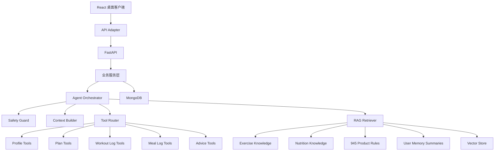
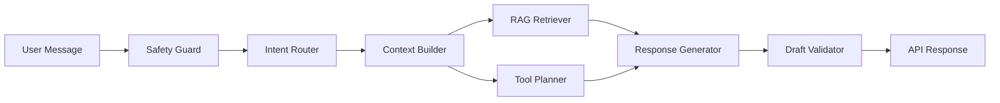

# 945 Agent 后端与 RAG 架构

版本：v0.1  
日期：2026-07-15  
状态：MVP 后端架构已部分实现

## 1. 这份文档解决什么问题

这份文档回答三个问题：

1. 945 的真实 Agent 后端应该怎么分层。
2. RAG 在这个产品里到底负责什么，不负责什么。
3. 从当前前端 mock demo 走到真实 Agent 系统，应该按什么顺序搭建。

当前项目已经有桌面客户端 demo、TypeScript 数据类型、mock API、HTTP adapter、FastAPI 结构化 API、MongoDB repository 边界、Agent 工具层、本地 RAG 检索、确定性 Agent graph 和 Playwright QA。下一阶段可以接真实 LLM 和向量库，但必须保留当前可测试的 deterministic/mock 路径。

## 2. 总体结论

945 需要 RAG，但 RAG 不是第一层，也不是数据库替代品。

推荐目标架构：

```text
桌面客户端
  -> API Adapter
    -> FastAPI
      -> 业务服务层
        -> Agent 编排层
          -> 工具调用
          -> RAG 检索
          -> 安全边界
      -> MongoDB / 结构化数据
      -> 向量库 / 知识库
```

核心原则：

- 用户档案、计划、训练记录、饮食记录、身体数据必须放在结构化数据库。
- RAG 负责检索动作知识、饮食知识、产品规则、历史摘要等辅助上下文。
- Agent 通过工具读取和写入结构化数据，不能绕过 API 直接改库。
- 关键写入必须生成草稿，并由用户确认。
- 高风险健康输入必须优先走安全边界，不继续输出高强度建议。

## 3. 分层架构



| 层级 | 职责 | 不做什么 |
| --- | --- | --- |
| React 桌面客户端 | 展示页面、发起操作、确认草稿 | 不直接调用模型 |
| API Adapter | 屏蔽 mock API 和真实 API 差异 | 不写业务规则 |
| FastAPI | 接收请求、鉴权预留、校验输入、返回统一响应 | 不把提示词写进路由 |
| 业务服务层 | 组织计划、记录、建议、设置等业务流程 | 不直接生成自然语言 |
| Agent Orchestrator | 编排安全检查、上下文构建、工具调用和模型输出 | 不绕过用户确认写入关键数据 |
| Tool Router | 把 Agent 意图转为可控工具调用 | 不允许任意函数执行 |
| RAG Retriever | 检索知识和长期摘要 | 不保存主业务事实 |
| MongoDB | 保存结构化事实 | 不做语义检索 |
| Vector Store | 保存可检索知识片段和摘要 | 不当作交易数据库 |

## 4. RAG 在 945 里应该检索什么

适合进入 RAG 的内容：

| 知识类型 | 示例 | 用途 |
| --- | --- | --- |
| 动作知识库 | 深蹲、卧推、划船、硬拉的动作要点和替代动作 | 回答动作解释、替代动作、注意事项 |
| 饮食知识库 | 常见食材、份量估算、宏量营养解释 | 辅助饮食建议和外食估算 |
| 产品规则 | 945 的计划调整原则、写入确认规则、安全边界 | 保证 Agent 按产品逻辑回答 |
| 用户长期摘要 | 最近 4 周执行情况、偏好摘要、常见限制 | 帮 Agent 理解长期趋势 |
| FAQ / 说明 | 如何记录训练、如何确认计划餐 | 回答产品使用问题 |

不适合用 RAG 当主存储的内容：

| 内容 | 正确存储位置 | 原因 |
| --- | --- | --- |
| 今日训练记录 | `workout_logs` | 需要精确查询、更新和统计 |
| 今日饮食记录 | `meal_logs` | 涉及热量和宏量营养计算 |
| 体重、体脂、围度 | `body_metrics` | 需要趋势计算和单位处理 |
| 当前训练计划 | `plans` | 需要版本、状态和确认流程 |
| 用户语言和单位 | `users` / `settings` | 应该确定、可覆盖、可校验 |

一句话判断：如果这个数据需要精确计算、更新、删除、排序、聚合，就不要把它只放进 RAG。

## 5. Agent 节点设计

第一版真实 Agent 不建议做一个大而全的提示词。建议拆成这些节点：



| 节点 | 输入 | 输出 |
| --- | --- | --- |
| Safety Guard | 用户消息、当前上下文 | 是否高风险、允许回答的范围 |
| Intent Router | 用户消息 | `ask_question`、`log_workout`、`log_meal`、`adjust_plan` 等意图 |
| Context Builder | `user_id`、日期、当前页面 | 用户资料、今日计划、近期记录、建议 |
| RAG Retriever | 意图、上下文、查询文本 | 相关知识片段 |
| Tool Planner | 意图、结构化上下文 | 需要调用的工具列表 |
| Response Generator | 上下文、知识片段、工具结果 | 自然语言回复和可选草稿 |
| Draft Validator | 草稿 | 字段校验、风险校验、是否需要确认 |

## 6. 工具调用边界

Agent 可以使用这些工具：

| 工具 | 能力 | 是否需要用户确认 |
| --- | --- | --- |
| `get_profile` | 读取用户资料 | 否 |
| `get_today_context` | 读取今日训练、饮食、打卡和建议 | 否 |
| `get_current_plan` | 读取当前计划 | 否 |
| `list_recent_workout_logs` | 读取近期训练记录 | 否 |
| `list_recent_meal_logs` | 读取近期饮食记录 | 否 |
| `create_workout_log_draft` | 生成训练记录草稿 | 是 |
| `create_meal_log_draft` | 生成饮食记录草稿 | 是 |
| `create_plan_adjustment_draft` | 生成计划调整草稿 | 是 |
| `accept_advice` | 标记建议已采纳 | 是 |

第一版不要开放“任意写库工具”。所有写入都应该是明确白名单工具，并且关键写入先产生 `RecordDraft`。

## 7. 后端目录建议

后端可以放在仓库的 `backend/` 目录：

```text
backend/
  app/
    main.py
    core/
      config.py
      safety.py
    api/
      routes_today.py
      routes_plans.py
      routes_workout_logs.py
      routes_meal_logs.py
      routes_body_metrics.py
      routes_advice.py
      routes_agent.py
    models/
      domain.py
      requests.py
      responses.py
    services/
      today_service.py
      plan_service.py
      workout_log_service.py
      meal_log_service.py
      advice_service.py
    agents/
      graph.py
      nodes.py
      prompts.py
      tools.py
      schemas.py
    rag/
      ingest.py
      retriever.py
      chunking.py
      sources/
    repositories/
      mongo.py
      users.py
      plans.py
      logs.py
      advice.py
  tests/
```

这个结构的重点是：路由、业务服务、Agent 编排、RAG、数据库访问分开，避免所有逻辑堆在一个 `agent.py` 里。

## 8. 一步步搭建顺序

### 第 0 步：冻结接口契约

先把 `docs/API_CONTRACT.md` 和 `docs/DATA_MODEL.md` 当成后端实现的合同。

验收：

- 前端页面依旧走 `mockApi`。
- 每个 mock API 都能找到未来对应的 HTTP API。
- 字段名统一使用 snake_case。

### 第 1 步：搭 FastAPI 空壳

目标是让后端先能启动，而不是马上接大模型。

要做：

- 创建 `backend/app/main.py`。
- 加 `/health`。
- 加统一响应格式 `{ data, error }`。
- 加 demo user 配置。

验收：

- `GET /health` 返回正常。
- 后端测试能跑。
- 不接数据库也能启动。

### 第 2 步：实现结构化 API

先实现不需要 Agent 的接口：

- `GET /api/demo-user`
- `GET /api/today`
- `GET /api/plans/current`
- `POST /api/workout-logs`
- `POST /api/meal-logs/confirm-planned-meal`
- `POST /api/body-metrics`
- `POST /api/daily-checkins`
- `GET /api/settings`

验收：

- 前端可以把 `mockApi` 换成 HTTP adapter。
- 今日页、训练页、饮食页、身体数据页、设置页能用真实 API 跑。

### 第 3 步：接 MongoDB

把内存数据换成数据库 repository。

当前状态：已实现 MongoDB repository、demo seed、repository-backed store 和 fake DB 测试；默认仍使用 demo store，`945_STORAGE_BACKEND=mongo` 可切换到 Mongo repository。

优先集合：

- `users`
- `user_profiles`
- `plans`
- `workout_logs`
- `meal_logs`
- `body_metrics`
- `daily_checkins`
- `agent_advice`
- `agent_messages`

验收：

- 重启后数据不丢。
- 每个写入接口有基本测试。
- 今日聚合能从多个集合算出状态摘要。

### 第 4 步：搭 Agent 工具层

先不做复杂 RAG，只让 Agent 能调用结构化工具。

当前状态：已实现白名单工具层，包含 profile/today/plan/log/advice 读取与草稿生成，关键写入仍需要用户确认。

要做：

- `get_today_context`
- `get_current_plan`
- `create_workout_log_draft`
- `create_meal_log_draft`
- `create_plan_adjustment_draft`

验收：

- 用户输入“今天深蹲 4 组 8 次 80kg”时，返回训练记录草稿。
- 草稿不自动保存。
- 前端确认后才写入 `workout_logs`。

### 第 5 步：搭 RAG 知识库

先用小规模知识库，不要一开始就做复杂内容平台。

当前状态：已实现本地关键词 retriever，覆盖 945 产品规则、安全边界、训练动作和饮食估算知识。它只作为上下文来源，不保存主业务事实。

第一批文档：

- 945 产品规则。
- 常见训练动作说明。
- 常见饮食和宏量营养说明。
- 安全边界说明。

每个知识片段需要 metadata：

```json
{
  "source_type": "exercise_knowledge",
  "topic": "squat",
  "locale": "zh-CN",
  "risk_level": "normal",
  "updated_at": "2026-07-15"
}
```

验收：

- Agent 能检索动作解释。
- Agent 能解释建议依据。
- Agent 回答里能区分“来自结构化记录”和“来自知识库”。

### 第 6 步：接 LangGraph 编排

当工具和 RAG 都能单独跑后，再接编排图。

当前状态：已实现 deterministic LangGraph-style graph，节点包含 safety guard、intent router、context builder、RAG retriever、tool planner、response generator 和 draft validator。当前不依赖真实 LLM。

建议节点：

```text
safety_guard
  -> intent_router
  -> context_builder
  -> rag_retriever
  -> tool_planner
  -> response_generator
  -> draft_validator
```

验收：

- 普通问答能回答。
- 记录类输入能生成草稿。
- 高风险输入不会继续建议高强度训练。
- 计划调整只生成草稿，不直接修改计划。

### 第 7 步：做长期记忆摘要

长期记忆不是把所有聊天塞进向量库。

当前状态：已实现每周长期记忆摘要 service，从结构化训练、饮食和打卡记录生成 `user_memory_summaries`，摘要不替代原始事实。

推荐做法：

- 原始记录继续留在 MongoDB。
- 每周生成一条用户摘要。
- 摘要进入 `user_memory_summaries` 和向量库。

摘要示例：

```text
用户最近 4 周每周训练 3-4 次，偏好上肢力量训练，腿部训练后疲劳较明显。
饮食上蛋白质达标率较高，但周末热量波动明显。
```

验收：

- Agent 能引用长期趋势。
- 用户单日记录仍可精确查询。
- 摘要可以重新生成，不作为唯一事实来源。

## 9. 安全边界

Agent 必须拦截或降级处理这些输入：

- 胸闷
- 眩晕
- 晕厥
- 强烈疼痛
- 疑似受伤
- 心脏不适
- 极端节食
- 进食障碍倾向

输出规则：

- 不做医疗诊断。
- 不给治疗方案。
- 不承诺结果。
- 不鼓励带伤训练。
- 高风险情况下建议暂停相关活动并咨询专业人士。

## 10. 前端如何从 mock 切到真实 API

当前前端调用：

```text
src/services/mockApi.ts
```

后续建议新增：

```text
src/services/httpApi.ts
src/services/apiClient.ts
```

切换方式：

```text
页面 -> apiClient -> mockApi 或 httpApi
```

这样页面不需要知道数据来自本地 mock 还是真实后端。

验收：

- 同一套页面可以用 mock 模式运行。
- 同一套页面可以用真实 API 模式运行。
- Playwright QA 可以分别跑 mock 和后端联调模式。

## 11. 最小可行后端里程碑

建议不要一口气做完整 Agent。按这个顺序交付：

1. FastAPI 空壳和健康检查。
2. demo user + 今日聚合 API。
3. 训练、饮食、身体数据、打卡写入 API。
4. 前端 HTTP adapter。
5. Agent 记录草稿生成。
6. RAG 动作和饮食知识检索。
7. Advice Agent 和每周计划调整。

每一步都要能单独验证，不要等全部做完再测试。

## 12. 当前阶段的下一步建议

当前最合理的下一步不是马上接大模型，而是：

1. 创建 `backend/`。
2. 实现 FastAPI 空壳。
3. 把 `docs/API_CONTRACT.md` 里的核心接口做出来。
4. 给前端加 `httpApi` adapter。
5. 等结构化 API 稳定后，再接 Agent 工具层和 RAG。

这样做的好处是：即使 Agent 还没接，产品也已经有真实数据闭环；Agent 接入后只是增强能力，不会把基础记录系统绑死在模型输出上。
