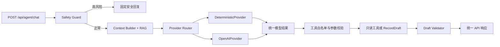

# 945 OpenAI LLM Provider 接入设计

版本：v1.0  
日期：2026-07-17  
状态：设计已确认，等待实施计划

## 1. 目标

在不破坏 945 当前 MVP 后端闭环的前提下，为 Agent 接入真实 OpenAI 模型能力。

本阶段完成后：

- `/api/agent/chat` 可以通过 OpenAI 理解用户意图、组织自然语言回复并建议白名单工具调用。
- 当前 deterministic Agent 继续保留，作为默认测试实现和开发环境降级路径。
- Safety Guard、结构化数据访问、工具白名单、草稿校验和用户确认仍由 945 后端控制。
- OpenAI 不可用时，开发环境自动降级；生产环境返回明确错误，不伪装成真实模型回复。
- 不配置 OpenAI 时，当前本地 demo 行为和现有测试保持不变。

## 2. 已确认的产品决策

| 决策项 | 结论 |
| --- | --- |
| 首个真实模型 Provider | OpenAI API |
| 编排方式 | 混合模式 |
| 接入结构 | 独立 `LLMProvider` 边界 |
| 模型策略 | 均衡成本与质量，单模型、环境变量配置 |
| 开发环境故障策略 | 自动降级到 deterministic Provider |
| 生产环境故障策略 | 明确返回 Provider 错误并记录运行事件 |
| Agent 写入规则 | 所有训练、饮食和计划变更先生成 `RecordDraft` |
| 最终写入规则 | 用户确认后调用结构化 API |
| 工具调用上限 | 每个聊天请求最多一轮工具调用 |
| OpenAI 逻辑生成上限 | 无工具时一次，有工具时最多两次 |

## 3. 范围与边界

### 3.1 本阶段包含

- OpenAI Python SDK 依赖和后端配置。
- `LLMProvider` 统一协议及模型输入输出类型。
- `DeterministicProvider`，封装当前规则逻辑。
- `OpenAIProvider`，通过 Responses API 生成结构化模型结果。
- Provider 选择、开发降级和生产错误映射。
- Agent Graph 与 Provider 的异步调用边界。
- 白名单工具建议、执行结果回传和最终回复生成。
- Provider 运行元数据与安全日志。
- 单元测试、API 测试、回归测试和可选真实 API 冒烟测试。
- 中文后端文档和环境变量说明。

### 3.2 本阶段不包含

- OpenAI Agents SDK 迁移。
- Anthropic、Ollama 或其他 Provider 实现。
- 流式输出、语音、图片或 Realtime API。
- embedding 向量化和向量数据库迁移。
- 生产鉴权、多租户隔离和计费。
- Agent 自动保存训练记录、饮食记录或计划变更。
- 自动选择“最新模型”或在运行时做多模型路由。

模型 ID 不写死在代码中。启用 OpenAI 时，部署方必须显式配置 `945_OPENAI_MODEL`，避免代码中的模型名称随时间失效。

## 4. 现有基础

945 当前已经具备：

- FastAPI Agent API。
- deterministic Agent Graph。
- Safety Guard、Intent Router、Context Builder、RAG Retriever、Tool Planner 和 Draft Validator。
- Agent 白名单工具和 `RecordDraft`。
- demo store 与 Mongo repository 边界。
- Agent 消息持久化边界。
- 本地关键词 RAG 和长期记忆摘要。

本设计只替换或增强“模型能力层”，不重写结构化业务 API，也不让 OpenAI 直接访问数据库。

## 5. 方案比较

### 5.1 方案 A：独立 Provider 层，已选择

Agent Graph 依赖统一 `LLMProvider`，由 Provider Router 选择 deterministic 或 OpenAI 实现。

优点：

- 保留当前 Agent Graph 和安全边界。
- SDK、模型名和网络错误被限制在 Provider 内。
- 测试不需要真实 API Key。
- 后续可以增加其他 Provider，而不改业务路由。

### 5.2 方案 B：改用 OpenAI Agents SDK，未选择

该方案会把工具编排和运行追踪交给 Agents SDK，但会与当前 Agent Graph、工具层和长期记忆边界重叠，改动范围过大。

### 5.3 方案 C：在节点内直接调用 OpenAI，未选择

该方案实现较快，但会让网络调用、错误处理和 SDK 类型散落在多个节点中，不利于测试、降级和后续替换。

## 6. 总体架构



核心原则：

1. Safety Guard 永远先于 Provider 调用。
2. Agent Graph 拥有编排权，Provider 只生成模型结果和工具建议。
3. Provider 不能直接执行 Python 函数或访问 MongoDB。
4. 工具名和参数必须通过后端白名单及 Pydantic 校验。
5. 写操作只产生 `RecordDraft`，不直接改变正式记录或计划。
6. OpenAI SDK 类型不能越过 Provider 层进入路由、业务服务或前端。

## 7. 组件设计

### 7.1 Provider 协议

新增 `backend/app/llm/`，作为模型能力边界：

```text
backend/app/llm/
  __init__.py
  models.py
  base.py
  deterministic.py
  openai_provider.py
  factory.py
  errors.py
```

职责：

| 文件 | 职责 |
| --- | --- |
| `models.py` | 定义 Provider 输入、输出、工具建议和运行元数据 |
| `base.py` | 定义异步 `LLMProvider` Protocol |
| `deterministic.py` | 封装当前确定性意图、草稿和回复逻辑 |
| `openai_provider.py` | 封装 OpenAI SDK、Responses API 和响应解析 |
| `factory.py` | 根据配置创建 Provider，并执行环境差异化降级 |
| `errors.py` | 定义稳定的内部 Provider 错误类型 |

Provider 的核心接口为：

```python
class LLMProvider(Protocol):
    async def generate(self, request: AgentModelRequest) -> AgentModelResponse:
        ...
```

### 7.2 统一输入

`AgentModelRequest` 包含：

- `user_id`
- `locale`
- `message`
- 最近 10 条对话消息
- 当前页面与日期上下文
- 当前用户资料和今日结构化上下文
- RAG 检索片段
- 本轮允许使用的工具描述
- 可选的上一轮工具执行结果

输入只包含回答当前问题所需的数据。不得把完整用户数据库、API Key、Mongo 连接信息或内部日志发送给 OpenAI。

### 7.3 统一输出

`AgentModelResponse` 包含：

- `intent`
- `reply`
- 可选 `tool_call`
- `provider`
- `model`
- Token 用量
- Provider 请求 ID

`tool_call` 只是一项建议，字段为：

- `name`
- `arguments`

Agent Graph 收到建议后必须重新验证工具名和参数，不能信任模型生成的函数名、JSON 或业务字段。

### 7.4 Provider Router

Provider Router 读取应用配置：

- `945_LLM_PROVIDER=deterministic`：直接使用当前确定性能力。
- `945_LLM_PROVIDER=openai`：使用 `OpenAIProvider`。
- 开发环境中 OpenAI 失败：记录降级原因后调用 deterministic Provider。
- 生产环境中 OpenAI 失败：抛出稳定的 Provider 错误，由 API 层映射为统一响应。

Router 不缓存用户对话状态。对话记录仍由 945 自己保存，避免 Provider 锁定和状态失真。

### 7.5 Agent Graph

`run_agent_graph` 改为异步调用，并继续负责：

- Safety Guard。
- 结构化上下文和 RAG 检索。
- Provider 调用。
- 工具白名单验证和执行。
- 最多一轮工具调用。
- `RecordDraft` 校验。
- 组装稳定的 `AgentGraphResult`。

`POST /api/agent/chat` 同步升级为异步路由。其他结构化 API 不受影响。

## 8. 完整数据流

1. API 接收 `user_id`、`locale`、`message` 和可选页面上下文。
2. 检查用户是否存在；未知用户继续返回 `404 NOT_FOUND`。
3. 读取最近 10 条已保存消息；当前用户消息作为本轮输入，暂不写入消息存储。
4. Safety Guard 检查高风险内容。
5. 命中高风险时直接返回本地安全回复，不调用 Provider，也不生成草稿。
6. 正常请求读取用户资料、今日计划、近期记录、最近 10 条消息和长期摘要。
7. RAG Retriever 返回与问题相关的本地知识片段。
8. Provider Router 选择 Provider。
9. Provider 第一次生成意图、初步回复和可选工具调用建议。
10. 无工具建议时进入草稿校验和最终响应。
11. 有工具建议时，Agent Graph 校验工具名、参数和调用权限。
12. Agent Graph 执行一个只读工具或草稿生成工具。
13. 工具结果回传给同一个 Provider，进行第二次也是最后一次生成。
14. Draft Validator 检查草稿字段和 `requires_confirmation=true`。
15. Graph 成功完成后，依次保存本轮用户消息、Agent 回复和可选草稿。
16. 返回现有 `{ data, error }` 响应结构。

每个请求最多执行一轮工具调用。Provider 在工具结果返回后再次建议工具时，Graph 必须忽略该建议并结束本轮，防止循环调用和费用失控。

Provider 失败并返回生产环境错误时，本轮用户消息和不完整 Agent 结果都不写入消息存储，以保持当前“成功后成对保存用户消息和 Agent 消息”的语义。高风险本地安全回复属于成功结果，仍保存完整一轮对话。

## 9. RecordDraft 与用户确认

训练、饮食和计划变更继续使用两阶段写入：

```text
用户自然语言
  -> Agent 解析
  -> RecordDraft
  -> 前端预览、修改或取消
  -> 用户确认
  -> 结构化 POST/PATCH API
  -> 数据库
```

例如用户输入“今天深蹲 4 组，每组 8 次，80kg，帮我记录”，Agent 只返回训练记录草稿。草稿本身不会出现在正式训练日志中。只有前端收到用户确认后调用 `POST /api/workout-logs`，记录才会进入数据库。

此规则适用于：

- 训练记录草稿。
- 饮食记录草稿。
- 训练计划调整草稿。
- 饮食计划调整草稿。

读取数据、解释动作、回答饮食问题和提供建议不需要确认，因为这些操作不会修改正式数据。

## 10. 配置

新增配置：

```text
945_APP_ENV=development|production
945_LLM_PROVIDER=deterministic|openai
OPENAI_API_KEY=...
945_OPENAI_MODEL=...
945_LLM_TIMEOUT_SECONDS=20
```

配置规则：

- 默认 `945_APP_ENV=development`。
- 默认 `945_LLM_PROVIDER=deterministic`。
- `945_LLM_PROVIDER=openai` 时，`OPENAI_API_KEY` 和 `945_OPENAI_MODEL` 必须存在。
- Key 和模型配置只在后端读取，不进入前端构建变量。
- 均衡模式第一版只使用一个模型，不做任务级模型路由。
- OpenAI SDK 版本在 `backend/requirements.txt` 中固定，避免 SDK 行为漂移。

## 11. 错误处理

| 场景 | 开发环境 | 生产环境 |
| --- | --- | --- |
| API Key 或模型未配置 | 降级到 deterministic | `503 LLM_CONFIG_ERROR` |
| 请求超时 | 有限重试一次，再降级 | 有限重试一次，再返回 `503 LLM_TIMEOUT` |
| 限流或额度不足 | 降级 | `503 LLM_RATE_LIMITED` |
| OpenAI 服务异常 | 降级 | `503 LLM_PROVIDER_ERROR` |
| 模型结构化输出不合法 | 丢弃非法输出并降级 | `502 LLM_OUTPUT_INVALID` |
| 高风险输入 | 本地安全回复 | 本地安全回复 |

每个逻辑生成步骤最多允许一次传输级重试，Agent Graph 本身不再叠加重试。因此正常请求最多有两个逻辑生成步骤；如果两个步骤都遇到可重试传输错误，底层 HTTP 尝试次数最多为四次。运行元数据必须分别记录逻辑生成次数和 HTTP 尝试次数。

错误继续使用统一结构：

```json
{
  "data": null,
  "error": {
    "code": "LLM_TIMEOUT",
    "message": "The model provider timed out.",
    "details": {
      "request_id": "..."
    }
  }
}
```

Provider 错误只影响 `/api/agent/chat`。训练、饮食、身体数据、计划和设置等结构化 API 必须继续工作。

## 12. 运行元数据与日志

每次 Provider 调用记录：

- 945 请求 ID。
- Provider 名称。
- 模型 ID。
- Provider 请求 ID。
- 调用次数。
- 总耗时。
- 输入和输出 Token 数量。
- 是否发生降级及稳定错误码。

普通日志不得记录：

- `OPENAI_API_KEY`。
- MongoDB URI 中的凭据。
- 完整系统提示词。
- 完整用户健康数据。
- 未脱敏的完整模型请求和响应。

`/health` 可以暴露 LLM 子系统是否配置和是否健康，但不得返回 Key、完整异常堆栈或用户数据。LLM 不健康不能让整个 FastAPI 应用停止提供结构化 API。

## 13. 测试策略

### 13.1 Provider 合约测试

- deterministic 和 OpenAI 实现满足相同接口。
- fake OpenAI client 可以返回普通回复、工具建议和结构化错误。
- SDK 原始对象不会进入 Agent Graph 结果。

### 13.2 安全与工具测试

- 高风险输入不会调用 Provider。
- 未知工具、非白名单工具和错误参数必须被拒绝。
- 每次请求最多执行一轮工具调用。
- 工具结果回传后不能触发第二轮工具执行。
- 所有写入型意图只能产生 `RecordDraft`。
- 草稿缺少确认标记或必填字段时必须被丢弃。

### 13.3 降级与错误测试

- 开发环境缺 Key、超时、限流、Provider 5xx 和输出错误时降级。
- 生产环境对相同场景返回稳定错误码。
- Provider 故障不影响其他 API。
- 日志和响应中不出现 API Key。

### 13.4 API 与回归测试

- `/api/agent/chat` 的成功响应形状保持兼容。
- 未知用户继续返回 `404 NOT_FOUND`。
- Agent 消息继续按用户保存。
- 当前后端测试全部通过。
- 前端构建和 Playwright QA 继续通过。

### 13.5 可选真实 API 冒烟测试

真实 OpenAI 冒烟测试必须同时满足以下条件才运行：

- 显式设置 `OPENAI_API_KEY`。
- 显式设置 `945_OPENAI_MODEL`。
- 显式开启真实 API 测试开关。

默认测试和 CI 跳过该测试，避免意外产生费用。冒烟测试只验证一条普通中文问答和一条训练草稿，不打印完整模型响应。

## 14. 验收标准

运行：

```powershell
python -m pytest backend/tests -q
npm run build
npm run qa:app
git diff --check
```

全部满足时才算完成：

1. 默认配置不需要 API Key，现有 deterministic demo 行为不变。
2. 启用 OpenAI 后可以生成自然语言回答和合规草稿。
3. Safety Guard 命中时 OpenAI 不会被调用。
4. 模型不能执行非白名单工具。
5. 模型不能直接保存训练、饮食或计划变更。
6. 开发和生产环境按确认的不同策略处理 Provider 故障。
7. Provider 故障不影响结构化业务 API。
8. 测试默认不访问真实 OpenAI，也不产生 API 费用。

## 15. 后续阶段

本阶段完成后，再按独立设计推进：

1. embedding 和向量库 RAG。
2. 真实 MongoDB 集成环境与可选集成测试。
3. 生产鉴权和用户数据隔离。
4. 计划生成、计划调整确认和版本化。
5. 流式输出及更完整的 Agent 运行追踪。
