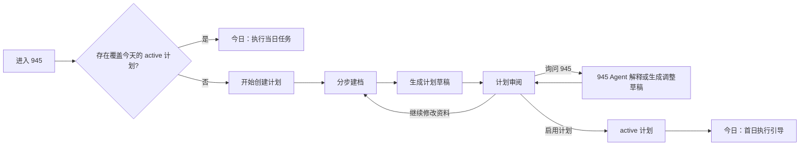

# 945 首次建档与计划生命周期重构设计

日期：2026-07-26  
状态：已确认设计，待用户审阅  
范围：桌面端首次使用与计划过期后的重新建档、生成、审阅、启用和首日进入流程

## 1. 背景与目标

945 的核心不是一次性生成计划，而是让用户经历清晰、可控的闭环：先建立个人资料，再生成计划草稿，审阅后主动启用，最后回到当日任务执行。当前页面将这些职责分散在今日页、计划页、设置页和 Agent 页，造成入口重复、数据写入时机不清楚、用户不知道下一步该做什么。

本轮优先服务两类用户：

- 首次进入、尚未建立有效计划的用户。
- 计划已到期，今日没有可执行训练和餐食的用户。

完成后，用户应能在不依赖 Agent 对话的前提下完成建档和启用计划；945 Agent 在每步提供解释与辅助，而不是代替用户填写关键信息或自动修改正式数据。

## 2. 设计原则与边界

### 2.1 设计原则

- **流程优先**：无有效计划时，界面只突出当前必要的下一步，不展示无法执行的今日任务。
- **表单主导，Agent 辅助**：结构化表单保证资料完整、可校验；945 解释字段、回答问题、识别风险并协助补充。
- **草稿先行，显式启用**：生成的计划始终是 `draft`，仅在用户点击“启用计划”后成为 `active`。
- **单一职责**：一个页面只负责一个阶段；任务执行、计划管理、对话确认不再混在同一页面。
- **事实与建议分离**：资料、计划和日志属于结构化事实；Agent 的解释、建议、记录草稿属于可审阅内容。

### 2.2 本轮不包含

- 医疗诊断、康复治疗或替代专业医疗建议。
- 自动采纳 Agent 建议、自动启用计划、自动写入训练/饮食记录。
- 食物识别、穿戴设备、教练后台、支付或移动端适配。
- 对训练和饮食执行页进行完整视觉重做；仅做满足新数据流的必要接入。

## 3. 用户主路径



状态定义：

| 用户状态 | 判定 | 主入口 | 禁止的行为 |
| --- | --- | --- | --- |
| `needs_onboarding` | 没有足够的 Profile，或用户主动重新建档 | `/onboarding` | 生成或启用计划 |
| `needs_plan` | Profile 完整，但没有覆盖今天的 `active` 计划 | `/onboarding` 的开始卡或 `/plan` | 将今日空态伪装成待执行计划 |
| `reviewing_draft` | 存在当前未处理的 `draft` 计划 | `/plan` | 将草稿写为 active 或展示为今日任务 |
| `active_today` | 存在覆盖今天的 `active` 计划 | `/` | 重新引导建档，除非用户主动选择重建 |

计划是否有效的唯一判断为：`plan.status === "active"` 且 `start_date <= today <= end_date`。不能只依据“当前有计划”或页面本地缓存判断。

## 4. 页面职责

### 4.1 今日 `/`

今日页是“今天要做什么”的行动队列，不是计划生成器，也不是完整聊天页。

**无有效计划时**：

- 显示一个明确的空态：没有覆盖今天的有效计划。
- 提供唯一主操作“开始创建计划”或“续建新计划”，跳转 `/onboarding`。
- 可展示最近一次计划的结束日期和“查看旧计划”次操作。
- 不展示伪造的训练、餐食、训练完成、饮食确认或建议执行按钮。

**有有效计划时**：

- 显示下一项训练、下一餐、每日打卡和一条建议摘要。
- 训练详情跳转 `/workout`；饮食详情跳转 `/diet`；建议详情跳转 `/advice`。
- 仅保留一个“询问 945”入口，跳转 `/agent` 并可携带当前页面上下文；删除今日页中的聊天输入、Agent 回复和草稿确认弹窗。
- 今日可快速确认计划餐、保存每日打卡；完整训练组次记录在训练页完成。

### 4.2 首次建档 `/onboarding`

该页是流程化表单，不直接自动启用计划。用户可见步骤、进度、上一步和草稿保存状态。

| 步骤 | 目的 | 字段 | 校验与输出 |
| --- | --- | --- | --- |
| 1. 基础资料 | 建立计算基础 | 昵称、年龄、性别可选、身高、体重、单位制 | 年龄 14-100；身高 100-250cm；体重 30-300kg |
| 2. 目标与节奏 | 明确计划方向 | 目标、目标强度、目标期限、每周训练天数、每次时长、经验 | 必填目标、频次和时长；提示不现实组合但允许修改 |
| 3. 训练条件 | 约束训练生成 | 场地、器械、可训练时段、动作限制、伤病/注意事项 | 至少一种训练环境；风险描述进入安全提示而非诊断 |
| 4. 饮食条件 | 约束饮食生成 | 饮食偏好、过敏/忌口、餐次、烹饪条件、预算倾向 | 过敏/忌口必须显式确认“无”或填写内容 |
| 5. 安全确认 | 让用户理解边界 | 健康风险/伤病确认、非医疗声明 | 未确认时不允许生成计划 |
| 6. 生成预览 | 保存资料并请求计划 | 资料摘要、生成按钮 | `PATCH /api/profile/{user_id}` 后 `POST /api/plans/generate`，成功进入 `/plan` |

945 辅助面板固定在分步表单右侧。它读取当前步骤的已填字段与校验状态，可解释字段、给出填写建议和提示安全风险；它不能绕过必填校验，也不能直接调用计划接受或记录写入接口。

### 4.3 计划 `/plan`

计划页只负责生命周期管理：生成、审阅、调整、启用和查看当前/历史计划。

- 当 Profile 完整且无草稿时，显示“生成计划草稿”。
- 草稿状态显示训练周安排、每日餐食目标、生成依据、已识别的限制和有效期；草稿不进入训练/饮食执行页。
- 用户可以返回 `/onboarding` 修改资料后重新生成，旧草稿保留为历史或显式作废。
- “询问 945”只打开 Agent 页并携带 `source=plan` 与草稿上下文。
- 用户点击“启用计划”后调用 `POST /api/plans/{plan_id}/accept`；成功后刷新有效计划并跳转 `/`。
- 计划调整仍由 Agent 生成 `plan_adjustment` 草稿，用户在统一确认队列中确认后调用结构化调整接口，绝不自动修改 active 计划。

### 4.4 945 Agent `/agent`

Agent 页是唯一的完整对话和草稿确认中心。

- 可从任意页面带入 `source`、当前计划、当前日期和选中对象上下文。
- 显示对话历史和“待确认操作”队列：训练记录、饮食记录、每日打卡、计划调整。
- 每份 `RecordDraft` 都必须显示摘要、关键字段、影响范围、确认和取消；确认时才调用相应结构化 API。
- 对于首次建档，Agent 可以回答“这个字段是什么意思”“我的目标应该怎么选”，也可以生成资料建议；Profile 的最终写入仍由表单提交。
- 对高风险健康描述，优先展示安全提醒并停止生成高风险训练建议。

### 4.5 训练 `/workout`

训练页只承担训练执行和历史：选择计划日、填写每组重量/次数/完成状态、保存真实 `WorkoutLog`、查看训练历史与完成率。它不得生成默认的虚构组次，也不得使用静态展示数据替代用户输入。计划不存在或计划日不在有效期时显示空态并引导 `/plan`。

### 4.6 饮食 `/diet`

饮食页只承担餐食执行和记录：查看有效计划日、确认计划餐、手动录入食物/宏量、查看当天与历史汇总。采购清单和饮食调整建议必须来自真实计划或 Advice 数据；无数据时显示空态，不显示静态示例内容。计划不存在或过期时引导 `/plan`。

### 4.7 身体 `/body`、建议 `/advice`、设置 `/settings`

- **身体**：记录和展示身体指标趋势，不承担建档。
- **建议**：承载主动生成的每日建议、周报、建议历史与状态；点击行动统一进入 Agent 确认队列，不直接改计划。
- **设置**：仅承载账户、语言、单位和长期偏好；可提供“重新建立资料/计划”入口，但不得在设置页直接生成并接受计划。

## 5. 统一数据流与职责归属

### 5.1 结构化事实

| 数据 | 唯一写入入口 | 消费页面 |
| --- | --- | --- |
| `UserProfile` | 建档表单提交、设置页局部更新 | 建档、计划、身体、Agent 上下文 |
| `Plan` draft | 计划生成接口 | 计划审阅、Agent 上下文 |
| `Plan` active | 明确的启用确认 | 今日、训练、饮食、建议、Agent |
| `WorkoutLog` | 训练页保存，或 Agent 草稿确认 | 今日摘要、训练、建议、Agent |
| `MealLog` | 饮食页保存/确认，或 Agent 草稿确认 | 今日摘要、饮食、建议、Agent |
| `DailyCheckin` | 今日页快速打卡，或 Agent 草稿确认 | 今日、身体、建议、Agent |

### 5.2 草稿与确认队列

前端新增概念上的 `ActionDraft` 队列，取代 `App.tsx` 中单个 `agentDraft` 及页面间回调传递。每项包含来源、类型、上下文、创建时间、状态和 payload：

```ts
type ActionDraft = {
  draft_id: string;
  source: "agent" | "advice" | "plan";
  record_draft: RecordDraft;
  context: { user_id: string; plan_id?: string; date: string; source_page: RouteId };
  status: "pending" | "confirmed" | "dismissed" | "failed";
  created_at: string;
};
```

本轮可先在 `App` 级 Context 管理队列，并在刷新后通过 Agent 消息历史恢复；后续再将草稿队列持久化为独立后端资源。任何页面只负责“创建或转交”草稿，只有 Agent 页负责确认、取消和错误重试。

### 5.3 活跃计划解析

新增共享的 `PlanContext`，在应用会话内统一请求并解析当前用户的 active plan：

- 所有页面以 API 返回的 `plan_id` 为准，禁止使用 `demoPlan.plan_id` 写入。
- 日期由当前运行日期或测试环境 `VITE_945_REFERENCE_DATE` 统一提供，禁止组件私自固化日期。
- `TodayResponseData`、训练和饮食数据都以同一 active plan 为来源。

## 6. 后端与接口调整

现有 Profile、计划、日志和 Agent API 可以支持首轮重构，需补足/统一以下边界：

1. `GET /api/plans/current` 必须可表达“无有效计划”，并在响应中提供 `coverage_status`：`active_today`、`expired`、`none`。
2. Profile 返回或新增 Onboarding 状态：`profile_completion`、缺失字段、`safety_confirmed_at`。安全确认是 Profile 的显式字段。
3. `POST /api/plans/generate` 仅生成 `draft`，并以已保存 Profile 的约束为输入；不得隐式 accept。
4. `POST /api/plans/{plan_id}/accept` 校验计划属于用户、状态为 draft，并归档之前的 active 计划。
5. 页面调用日志接口时必须携带由 active plan 解析出的 `plan_id`，计划不存在时前端不发写入请求。
6. Agent Chat 继续返回 `RecordDraft`，但不保存主业务事实；前端确认后调用已有的结构化 API。

## 7. 状态、失败处理与安全

- Profile 保存失败：留在当前步骤，展示字段级或请求级错误，不清除用户已输入内容。
- 计划生成失败：保留 Profile，允许重试；不能把失败草稿当成计划展示。
- 启用失败：草稿保持可审阅，不能跳转今日页或更新 active plan 本地状态。
- 计划过期：今日、训练和饮食页统一显示有效期已结束，并只引导续建，不显示假数据。
- 草稿确认失败：在 Agent 队列保留失败项并显示可重试状态；不把它标记为已保存。
- 高风险健康输入：945 只给出安全提醒、建议停止相关训练并咨询合格专业人士；不提供诊断、处方或康复方案。

## 8. 分阶段实施与验收

### 阶段 1：计划状态与页面入口

- 建立 Active Plan 统一解析与 `coverage_status`。
- 今日空态只展示续建入口；训练/饮食无有效计划时显示一致空态。
- 清除今日页中的完整聊天、草稿确认和计划写入职责。

**验收**：计划过期用户访问任一执行页，均不会看到静态或过期任务；点击主操作可进入建档流程。

### 阶段 2：分步建档与草稿审阅

- 把单页建档改为六步流程，增加安全确认、草稿保存与右侧 945 辅助。
- 生成后进入计划审阅，不再自动启用。
- 计划页实现草稿、启用、修改资料后重新生成的明确状态。

**验收**：首次用户必须完成必填资料和安全确认，才能生成草稿；生成后必须显式点击启用，今日页才出现任务。

### 阶段 3：统一 Agent 草稿队列与执行页去静态化

- 使用全局 ActionDraft 队列承接 Plan、Advice、Agent 发起的草稿。
- Agent 页成为唯一确认面；删除跨页面单草稿 props。
- 训练组次和手动饮食录入改为真实可编辑数据，移除静态历史、静态建议和静态采购项。

**验收**：所有“确认”写入都有 API 成功反馈；取消不写入；训练/饮食页面的数值来自实际计划和日志。

## 9. 测试要求

- 单元测试：计划覆盖状态、资料完成状态、安全确认、草稿状态转换。
- API 测试：无有效计划、生成 draft、拒绝未确认的 accept、accept 后旧计划归档、草稿确认后才产生日志。
- 前端路由测试：首次用户、过期用户、草稿审阅用户、active 用户分别进入正确页面和空态。
- Playwright HTTP 回归：从建档到启用后，今日页显示当前计划；训练和饮食页可以读取 active plan；Agent 草稿确认仅产生一次结构化记录。
- 回归检查：`python -m pytest backend/tests -q`、`npm run build`、`npm run qa:http`、`git diff --check`。

## 10. 成功标准

- 首次或过期用户在任意入口都能在两次以内的导航中到达“开始创建计划”。
- 用户不会在未启用计划时看见可执行的训练或饮食任务。
- 计划生成、审阅和启用是三个可观察、可恢复的独立状态。
- 945 辅助建档但不绕过表单校验；它生成的训练、饮食和计划变更仍须用户确认。
- 今日、训练、饮食、计划、建议和 Agent 页面各自只有一项明确的主要职责。
