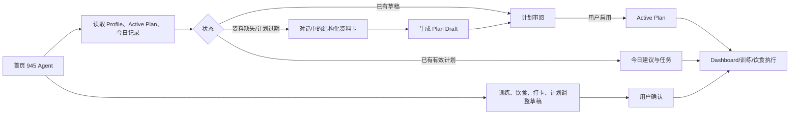

# 945 Agent-First 产品流程设计

日期：2026-07-29  
状态：已确认方向，待文档审阅  
替代范围：替代 `2026-07-26-onboarding-plan-lifecycle-design.md` 中“表单主导，Agent 辅助”的入口设计；保留其计划状态、资料安全确认、草稿确认和执行数据边界。

## 1. 产品原则

945 是综合健身教练 Agent，不是以 Dashboard 为中心的健身数据工具。

产品入口必须满足：

```text
打开 945 -> 与 945 Agent 对话 -> 收集或分析状态 -> 生成草稿 -> 用户确认 -> Dashboard 执行与查看结果
```

训练、饮食、恢复、身体数据和建议都是 945 理解用户与生成建议的上下文，不是用户首次进入时必须自行寻找的功能模块。

## 2. 不变的视觉与安全边界

- 不改变现有桌面端视觉风格、颜色、字体、图标、导航外观、玻璃质感或组件视觉样式。
- 允许调整首页内容、页面职责、路由默认页、内容布局和交互流程。
- 计划、训练记录、饮食记录和计划调整仍先生成 `RecordDraft`；用户显式确认后才调用结构化写入 API。
- 健康风险、伤病或异常信号仍优先返回安全提醒；945 不提供医疗诊断、治疗或康复处方。

## 3. 首页与路由

### 3.1 首页 `/`

`/` 永远渲染完整的 945 Agent 工作区，而不是 Today Dashboard 或独立建档表单。

| 用户状态 | Agent 首屏行为 | 下一步 |
| --- | --- | --- |
| `active_today` | 主动摘要今天的训练、饮食、恢复和一条建议；用户可继续提问或进入执行页 | 打开 Dashboard、训练、饮食或确认草稿 |
| `expired` | 说明当前计划没有覆盖今天，询问是否续建计划 | 对话内资料卡、生成计划草稿 |
| `none` / `incomplete` | 欢迎用户，解释 945 会据此生成训练与饮食计划 | 对话内资料卡、生成计划草稿 |
| `reviewing_draft` | 告知已有待审阅计划草稿 | 打开计划审阅、询问解释、启用计划 |

首页的 Agent 不暴露模型思维链；可展示可理解的进度状态，例如“正在读取当前计划”“正在整理训练与饮食约束”“正在生成计划草稿”。

### 3.2 Dashboard 与现有页面

- `TodayPage` 保留当前视觉样式，改为“今日执行与结果”页面，可改用 `/today` 路由。
- `AgentPage` 的对话、上下文和草稿确认能力迁为首页主内容；`/agent` 重定向到 `/`，保留旧链接兼容。
- `OnboardingPage` 不再作为首次入口。其结构化字段拆成可嵌入 Agent 工作区的资料卡；字段校验和安全确认规则继续复用。
- `PlanPage` 保持计划草稿审阅、启用和调整职责；不再承担首次资料收集。
- 训练、饮食、身体、建议和设置保持现有视觉与路由，分别承担执行、记录、趋势、主动建议和偏好设置。

## 4. Agent 对话中的结构化输入

纯聊天不能取代可校验资料。Agent 根据缺失数据插入轻量结构化卡，而不是跳转独立表单页：

1. 目标与基础数据：目标、年龄、身高、体重、经验。
2. 训练条件：频次、时长、器械、限制。
3. 饮食条件：偏好、过敏/忌口、餐次。
4. 安全确认：风险/伤病注意事项与非医疗声明。

卡片每次只收集当前必须的信息，保存到 Profile 草稿；所有必填字段完整且安全确认后，Agent 才可调用计划生成接口。用户仍可选择“稍后补充”，此时 Agent 只回答知识问题，不生成正式计划。

## 5. 状态与数据流



`PlanContext` 继续是 Profile、当前计划、计划覆盖状态和统一日期的唯一前端来源。所有正式写入仍使用由 `PlanContext` 解析的 active `plan_id`；没有 active plan 时不允许写计划餐确认或训练计划日志。

## 6. 最小实施范围

第一批只完成 Agent-first 可体验闭环：

1. 将 `/` 改为 Agent 工作区，`/agent` 兼容重定向。
2. 根据 `PlanContext` 在 Agent 工作区展示四种用户状态。
3. 将首次建档入口改为 Agent 内的资料卡入口；先复用既有 Profile 写入和计划生成/启用 API。
4. 将 Dashboard 迁为 `/today`，保留现有视觉和执行功能。
5. 用 mock/deterministic Provider 验证：无计划 -> 资料卡 -> 计划草稿 -> 启用 -> `/today`。

本批不接真实模型、不新增视觉系统、不拆新的多 Agent、不引入 LangSmith/Eval/Checkpoint；这些在 Agent-first 主链路稳定后按 Lv3/Lv4 计划推进。

## 7. 验收标准

- 首次用户打开 `/` 时看见 945 Agent，而不是 Dashboard 或独立建档页。
- 计划过期用户打开 `/` 时由 Agent 说明原因并可开始续建。
- 用户无需离开首页即可提交必要资料、生成计划草稿并进入计划审阅。
- 用户未启用计划前，Dashboard、训练和饮食页不展示虚构执行任务。
- 用户启用计划后，首页 Agent 能读取新计划；`/today` 展示当前计划的执行内容。
- 所有现有视觉 token 与导航样式保持不变；本批变更不以“美化 UI”为目标。
